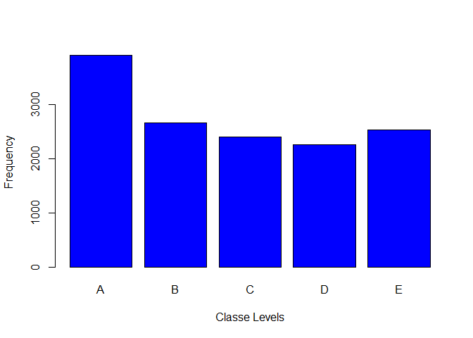
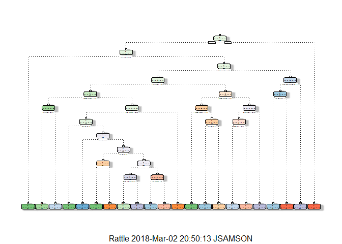

# PredictProject
Joel  
February 5, 2018  


## Summary

First Installed all necessary packages and set the working directory, libraries and seed for line numbers. 
Second downloaded both training and test files into working directory, then took training file and split into 2 files
subtraining and subtesting. Now I can build my model using subtraining data and predict with subtesting data, then 
do the same with another model. Once two models built and predicted. select the best of 2 and apply to original test 
data. The data for this project come from this source: <http://web.archive.org/web/20161224072740/http:/groupware.les.inf.puc-rio.br/har>

### Installed the necessary packages, and set libraries and seed.


```r
library(caret);
```

```
## Loading required package: lattice
```

```
## Loading required package: ggplot2
```

```r
library(ggplot2); 
library(randomForest);
```

```
## randomForest 4.6-12
```

```
## Type rfNews() to see new features/changes/bug fixes.
```

```
## 
## Attaching package: 'randomForest'
```

```
## The following object is masked from 'package:ggplot2':
## 
##     margin
```

```r
library(rpart);
library(rpart.plot);
library(rattle);
```

```
## Rattle: A free graphical interface for data science with R.
## Version 5.1.0 Copyright (c) 2006-2017 Togaware Pty Ltd.
## Type 'rattle()' to shake, rattle, and roll your data.
```

```
## 
## Attaching package: 'rattle'
```

```
## The following object is masked from 'package:randomForest':
## 
##     importance
```

```r
getwd();
```

```
## [1] "C:/Joel/Rworking"
```

```r
set.seed(12234);
```


### Read Training and Test Data with some cleaning 


### Checked the column names and some basic numbers

```r
head(training); summary(training); dim(training); names(training)
head(testing); summary(testing); dim(testing); names(testing)
```


### Clean up some data and fields

```r
## Remove columns with string "name", "timestamp", "window", "X"
Cl <- grep("name|timestamp|window|X", colnames(training1), value=F) 
trainingCl <- training1[,-Cl]

# (OR)
```


```r
# Remove unwanted fields, first 7 fields
training   <-training[,-c(1:7)]
testing <-testing[,-c(1:7)]

#Remove columns with over 95% missing data, exclude them from the file
training[training==""] <- NA
NAtoRM <- apply(training, 2, function(x) sum(is.na(x)))/nrow(training)
training <- training[!(NAtoRM>0.95)]

testing[testing==""] <- NA
NAtoRM2 <- apply(testing, 2, function(x) sum(is.na(x)))/nrow(testing)
testing <- testing[!(NAtoRM2>0.95)]

# Making sure the column names that I want available
head(training); summary(training); dim(training); names(training)
```

```
##   roll_belt pitch_belt yaw_belt total_accel_belt gyros_belt_x gyros_belt_y
## 1      1.41       8.07    -94.4                3         0.00         0.00
## 2      1.41       8.07    -94.4                3         0.02         0.00
## 3      1.42       8.07    -94.4                3         0.00         0.00
## 4      1.48       8.05    -94.4                3         0.02         0.00
## 5      1.48       8.07    -94.4                3         0.02         0.02
## 6      1.45       8.06    -94.4                3         0.02         0.00
##   gyros_belt_z accel_belt_x accel_belt_y accel_belt_z magnet_belt_x
## 1        -0.02          -21            4           22            -3
## 2        -0.02          -22            4           22            -7
## 3        -0.02          -20            5           23            -2
## 4        -0.03          -22            3           21            -6
## 5        -0.02          -21            2           24            -6
## 6        -0.02          -21            4           21             0
##   magnet_belt_y magnet_belt_z roll_arm pitch_arm yaw_arm total_accel_arm
## 1           599          -313     -128      22.5    -161              34
## 2           608          -311     -128      22.5    -161              34
## 3           600          -305     -128      22.5    -161              34
## 4           604          -310     -128      22.1    -161              34
## 5           600          -302     -128      22.1    -161              34
## 6           603          -312     -128      22.0    -161              34
##   gyros_arm_x gyros_arm_y gyros_arm_z accel_arm_x accel_arm_y accel_arm_z
## 1        0.00        0.00       -0.02        -288         109        -123
## 2        0.02       -0.02       -0.02        -290         110        -125
## 3        0.02       -0.02       -0.02        -289         110        -126
## 4        0.02       -0.03        0.02        -289         111        -123
## 5        0.00       -0.03        0.00        -289         111        -123
## 6        0.02       -0.03        0.00        -289         111        -122
##   magnet_arm_x magnet_arm_y magnet_arm_z roll_dumbbell pitch_dumbbell
## 1         -368          337          516      13.05217      -70.49400
## 2         -369          337          513      13.13074      -70.63751
## 3         -368          344          513      12.85075      -70.27812
## 4         -372          344          512      13.43120      -70.39379
## 5         -374          337          506      13.37872      -70.42856
## 6         -369          342          513      13.38246      -70.81759
##   yaw_dumbbell total_accel_dumbbell gyros_dumbbell_x gyros_dumbbell_y
## 1    -84.87394                   37                0            -0.02
## 2    -84.71065                   37                0            -0.02
## 3    -85.14078                   37                0            -0.02
## 4    -84.87363                   37                0            -0.02
## 5    -84.85306                   37                0            -0.02
## 6    -84.46500                   37                0            -0.02
##   gyros_dumbbell_z accel_dumbbell_x accel_dumbbell_y accel_dumbbell_z
## 1             0.00             -234               47             -271
## 2             0.00             -233               47             -269
## 3             0.00             -232               46             -270
## 4            -0.02             -232               48             -269
## 5             0.00             -233               48             -270
## 6             0.00             -234               48             -269
##   magnet_dumbbell_x magnet_dumbbell_y magnet_dumbbell_z roll_forearm
## 1              -559               293               -65         28.4
## 2              -555               296               -64         28.3
## 3              -561               298               -63         28.3
## 4              -552               303               -60         28.1
## 5              -554               292               -68         28.0
## 6              -558               294               -66         27.9
##   pitch_forearm yaw_forearm total_accel_forearm gyros_forearm_x
## 1         -63.9        -153                  36            0.03
## 2         -63.9        -153                  36            0.02
## 3         -63.9        -152                  36            0.03
## 4         -63.9        -152                  36            0.02
## 5         -63.9        -152                  36            0.02
## 6         -63.9        -152                  36            0.02
##   gyros_forearm_y gyros_forearm_z accel_forearm_x accel_forearm_y
## 1            0.00           -0.02             192             203
## 2            0.00           -0.02             192             203
## 3           -0.02            0.00             196             204
## 4           -0.02            0.00             189             206
## 5            0.00           -0.02             189             206
## 6           -0.02           -0.03             193             203
##   accel_forearm_z magnet_forearm_x magnet_forearm_y magnet_forearm_z
## 1            -215              -17              654              476
## 2            -216              -18              661              473
## 3            -213              -18              658              469
## 4            -214              -16              658              469
## 5            -214              -17              655              473
## 6            -215               -9              660              478
##   classe
## 1      A
## 2      A
## 3      A
## 4      A
## 5      A
## 6      A
```

```
##    roll_belt        pitch_belt          yaw_belt       total_accel_belt
##  Min.   :-28.90   Min.   :-55.8000   Min.   :-180.00   Min.   : 0.00   
##  1st Qu.:  1.10   1st Qu.:  1.7600   1st Qu.: -88.30   1st Qu.: 3.00   
##  Median :113.00   Median :  5.2800   Median : -13.00   Median :17.00   
##  Mean   : 64.41   Mean   :  0.3053   Mean   : -11.21   Mean   :11.31   
##  3rd Qu.:123.00   3rd Qu.: 14.9000   3rd Qu.:  12.90   3rd Qu.:18.00   
##  Max.   :162.00   Max.   : 60.3000   Max.   : 179.00   Max.   :29.00   
##   gyros_belt_x        gyros_belt_y       gyros_belt_z    
##  Min.   :-1.040000   Min.   :-0.64000   Min.   :-1.4600  
##  1st Qu.:-0.030000   1st Qu.: 0.00000   1st Qu.:-0.2000  
##  Median : 0.030000   Median : 0.02000   Median :-0.1000  
##  Mean   :-0.005592   Mean   : 0.03959   Mean   :-0.1305  
##  3rd Qu.: 0.110000   3rd Qu.: 0.11000   3rd Qu.:-0.0200  
##  Max.   : 2.220000   Max.   : 0.64000   Max.   : 1.6200  
##   accel_belt_x       accel_belt_y     accel_belt_z     magnet_belt_x  
##  Min.   :-120.000   Min.   :-69.00   Min.   :-275.00   Min.   :-52.0  
##  1st Qu.: -21.000   1st Qu.:  3.00   1st Qu.:-162.00   1st Qu.:  9.0  
##  Median : -15.000   Median : 35.00   Median :-152.00   Median : 35.0  
##  Mean   :  -5.595   Mean   : 30.15   Mean   : -72.59   Mean   : 55.6  
##  3rd Qu.:  -5.000   3rd Qu.: 61.00   3rd Qu.:  27.00   3rd Qu.: 59.0  
##  Max.   :  85.000   Max.   :164.00   Max.   : 105.00   Max.   :485.0  
##  magnet_belt_y   magnet_belt_z       roll_arm         pitch_arm      
##  Min.   :354.0   Min.   :-623.0   Min.   :-180.00   Min.   :-88.800  
##  1st Qu.:581.0   1st Qu.:-375.0   1st Qu.: -31.77   1st Qu.:-25.900  
##  Median :601.0   Median :-320.0   Median :   0.00   Median :  0.000  
##  Mean   :593.7   Mean   :-345.5   Mean   :  17.83   Mean   : -4.612  
##  3rd Qu.:610.0   3rd Qu.:-306.0   3rd Qu.:  77.30   3rd Qu.: 11.200  
##  Max.   :673.0   Max.   : 293.0   Max.   : 180.00   Max.   : 88.500  
##     yaw_arm          total_accel_arm  gyros_arm_x        gyros_arm_y     
##  Min.   :-180.0000   Min.   : 1.00   Min.   :-6.37000   Min.   :-3.4400  
##  1st Qu.: -43.1000   1st Qu.:17.00   1st Qu.:-1.33000   1st Qu.:-0.8000  
##  Median :   0.0000   Median :27.00   Median : 0.08000   Median :-0.2400  
##  Mean   :  -0.6188   Mean   :25.51   Mean   : 0.04277   Mean   :-0.2571  
##  3rd Qu.:  45.8750   3rd Qu.:33.00   3rd Qu.: 1.57000   3rd Qu.: 0.1400  
##  Max.   : 180.0000   Max.   :66.00   Max.   : 4.87000   Max.   : 2.8400  
##   gyros_arm_z       accel_arm_x       accel_arm_y      accel_arm_z     
##  Min.   :-2.3300   Min.   :-404.00   Min.   :-318.0   Min.   :-636.00  
##  1st Qu.:-0.0700   1st Qu.:-242.00   1st Qu.: -54.0   1st Qu.:-143.00  
##  Median : 0.2300   Median : -44.00   Median :  14.0   Median : -47.00  
##  Mean   : 0.2695   Mean   : -60.24   Mean   :  32.6   Mean   : -71.25  
##  3rd Qu.: 0.7200   3rd Qu.:  84.00   3rd Qu.: 139.0   3rd Qu.:  23.00  
##  Max.   : 3.0200   Max.   : 437.00   Max.   : 308.0   Max.   : 292.00  
##   magnet_arm_x     magnet_arm_y     magnet_arm_z    roll_dumbbell    
##  Min.   :-584.0   Min.   :-392.0   Min.   :-597.0   Min.   :-153.71  
##  1st Qu.:-300.0   1st Qu.:  -9.0   1st Qu.: 131.2   1st Qu.: -18.49  
##  Median : 289.0   Median : 202.0   Median : 444.0   Median :  48.17  
##  Mean   : 191.7   Mean   : 156.6   Mean   : 306.5   Mean   :  23.84  
##  3rd Qu.: 637.0   3rd Qu.: 323.0   3rd Qu.: 545.0   3rd Qu.:  67.61  
##  Max.   : 782.0   Max.   : 583.0   Max.   : 694.0   Max.   : 153.55  
##  pitch_dumbbell     yaw_dumbbell      total_accel_dumbbell
##  Min.   :-149.59   Min.   :-150.871   Min.   : 0.00       
##  1st Qu.: -40.89   1st Qu.: -77.644   1st Qu.: 4.00       
##  Median : -20.96   Median :  -3.324   Median :10.00       
##  Mean   : -10.78   Mean   :   1.674   Mean   :13.72       
##  3rd Qu.:  17.50   3rd Qu.:  79.643   3rd Qu.:19.00       
##  Max.   : 149.40   Max.   : 154.952   Max.   :58.00       
##  gyros_dumbbell_x    gyros_dumbbell_y   gyros_dumbbell_z 
##  Min.   :-204.0000   Min.   :-2.10000   Min.   : -2.380  
##  1st Qu.:  -0.0300   1st Qu.:-0.14000   1st Qu.: -0.310  
##  Median :   0.1300   Median : 0.03000   Median : -0.130  
##  Mean   :   0.1611   Mean   : 0.04606   Mean   : -0.129  
##  3rd Qu.:   0.3500   3rd Qu.: 0.21000   3rd Qu.:  0.030  
##  Max.   :   2.2200   Max.   :52.00000   Max.   :317.000  
##  accel_dumbbell_x  accel_dumbbell_y  accel_dumbbell_z  magnet_dumbbell_x
##  Min.   :-419.00   Min.   :-189.00   Min.   :-334.00   Min.   :-643.0   
##  1st Qu.: -50.00   1st Qu.:  -8.00   1st Qu.:-142.00   1st Qu.:-535.0   
##  Median :  -8.00   Median :  41.50   Median :  -1.00   Median :-479.0   
##  Mean   : -28.62   Mean   :  52.63   Mean   : -38.32   Mean   :-328.5   
##  3rd Qu.:  11.00   3rd Qu.: 111.00   3rd Qu.:  38.00   3rd Qu.:-304.0   
##  Max.   : 235.00   Max.   : 315.00   Max.   : 318.00   Max.   : 592.0   
##  magnet_dumbbell_y magnet_dumbbell_z  roll_forearm       pitch_forearm   
##  Min.   :-3600     Min.   :-262.00   Min.   :-180.0000   Min.   :-72.50  
##  1st Qu.:  231     1st Qu.: -45.00   1st Qu.:  -0.7375   1st Qu.:  0.00  
##  Median :  311     Median :  13.00   Median :  21.7000   Median :  9.24  
##  Mean   :  221     Mean   :  46.05   Mean   :  33.8265   Mean   : 10.71  
##  3rd Qu.:  390     3rd Qu.:  95.00   3rd Qu.: 140.0000   3rd Qu.: 28.40  
##  Max.   :  633     Max.   : 452.00   Max.   : 180.0000   Max.   : 89.80  
##   yaw_forearm      total_accel_forearm gyros_forearm_x  
##  Min.   :-180.00   Min.   :  0.00      Min.   :-22.000  
##  1st Qu.: -68.60   1st Qu.: 29.00      1st Qu.: -0.220  
##  Median :   0.00   Median : 36.00      Median :  0.050  
##  Mean   :  19.21   Mean   : 34.72      Mean   :  0.158  
##  3rd Qu.: 110.00   3rd Qu.: 41.00      3rd Qu.:  0.560  
##  Max.   : 180.00   Max.   :108.00      Max.   :  3.970  
##  gyros_forearm_y     gyros_forearm_z    accel_forearm_x   accel_forearm_y 
##  Min.   : -7.02000   Min.   : -8.0900   Min.   :-498.00   Min.   :-632.0  
##  1st Qu.: -1.46000   1st Qu.: -0.1800   1st Qu.:-178.00   1st Qu.:  57.0  
##  Median :  0.03000   Median :  0.0800   Median : -57.00   Median : 201.0  
##  Mean   :  0.07517   Mean   :  0.1512   Mean   : -61.65   Mean   : 163.7  
##  3rd Qu.:  1.62000   3rd Qu.:  0.4900   3rd Qu.:  76.00   3rd Qu.: 312.0  
##  Max.   :311.00000   Max.   :231.0000   Max.   : 477.00   Max.   : 923.0  
##  accel_forearm_z   magnet_forearm_x  magnet_forearm_y magnet_forearm_z
##  Min.   :-446.00   Min.   :-1280.0   Min.   :-896.0   Min.   :-973.0  
##  1st Qu.:-182.00   1st Qu.: -616.0   1st Qu.:   2.0   1st Qu.: 191.0  
##  Median : -39.00   Median : -378.0   Median : 591.0   Median : 511.0  
##  Mean   : -55.29   Mean   : -312.6   Mean   : 380.1   Mean   : 393.6  
##  3rd Qu.:  26.00   3rd Qu.:  -73.0   3rd Qu.: 737.0   3rd Qu.: 653.0  
##  Max.   : 291.00   Max.   :  672.0   Max.   :1480.0   Max.   :1090.0  
##  classe  
##  A:5580  
##  B:3797  
##  C:3422  
##  D:3216  
##  E:3607  
## 
```

```
## [1] 19622    53
```

```
##  [1] "roll_belt"            "pitch_belt"           "yaw_belt"            
##  [4] "total_accel_belt"     "gyros_belt_x"         "gyros_belt_y"        
##  [7] "gyros_belt_z"         "accel_belt_x"         "accel_belt_y"        
## [10] "accel_belt_z"         "magnet_belt_x"        "magnet_belt_y"       
## [13] "magnet_belt_z"        "roll_arm"             "pitch_arm"           
## [16] "yaw_arm"              "total_accel_arm"      "gyros_arm_x"         
## [19] "gyros_arm_y"          "gyros_arm_z"          "accel_arm_x"         
## [22] "accel_arm_y"          "accel_arm_z"          "magnet_arm_x"        
## [25] "magnet_arm_y"         "magnet_arm_z"         "roll_dumbbell"       
## [28] "pitch_dumbbell"       "yaw_dumbbell"         "total_accel_dumbbell"
## [31] "gyros_dumbbell_x"     "gyros_dumbbell_y"     "gyros_dumbbell_z"    
## [34] "accel_dumbbell_x"     "accel_dumbbell_y"     "accel_dumbbell_z"    
## [37] "magnet_dumbbell_x"    "magnet_dumbbell_y"    "magnet_dumbbell_z"   
## [40] "roll_forearm"         "pitch_forearm"        "yaw_forearm"         
## [43] "total_accel_forearm"  "gyros_forearm_x"      "gyros_forearm_y"     
## [46] "gyros_forearm_z"      "accel_forearm_x"      "accel_forearm_y"     
## [49] "accel_forearm_z"      "magnet_forearm_x"     "magnet_forearm_y"    
## [52] "magnet_forearm_z"     "classe"
```

```r
head(testing); summary(testing); dim(testing); names(testing)
```

```
##   roll_belt pitch_belt yaw_belt total_accel_belt gyros_belt_x gyros_belt_y
## 1    123.00      27.00    -4.75               20        -0.50        -0.02
## 2      1.02       4.87   -88.90                4        -0.06        -0.02
## 3      0.87       1.82   -88.50                5         0.05         0.02
## 4    125.00     -41.60   162.00               17         0.11         0.11
## 5      1.35       3.33   -88.60                3         0.03         0.02
## 6     -5.92       1.59   -87.70                4         0.10         0.05
##   gyros_belt_z accel_belt_x accel_belt_y accel_belt_z magnet_belt_x
## 1        -0.46          -38           69         -179           -13
## 2        -0.07          -13           11           39            43
## 3         0.03            1           -1           49            29
## 4        -0.16           46           45         -156           169
## 5         0.00           -8            4           27            33
## 6        -0.13          -11          -16           38            31
##   magnet_belt_y magnet_belt_z roll_arm pitch_arm yaw_arm total_accel_arm
## 1           581          -382     40.7    -27.80     178              10
## 2           636          -309      0.0      0.00       0              38
## 3           631          -312      0.0      0.00       0              44
## 4           608          -304   -109.0     55.00    -142              25
## 5           566          -418     76.1      2.76     102              29
## 6           638          -291      0.0      0.00       0              14
##   gyros_arm_x gyros_arm_y gyros_arm_z accel_arm_x accel_arm_y accel_arm_z
## 1       -1.65        0.48       -0.18          16          38          93
## 2       -1.17        0.85       -0.43        -290         215         -90
## 3        2.10       -1.36        1.13        -341         245         -87
## 4        0.22       -0.51        0.92        -238         -57           6
## 5       -1.96        0.79       -0.54        -197         200         -30
## 6        0.02        0.05       -0.07         -26         130         -19
##   magnet_arm_x magnet_arm_y magnet_arm_z roll_dumbbell pitch_dumbbell
## 1         -326          385          481     -17.73748       24.96085
## 2         -325          447          434      54.47761      -53.69758
## 3         -264          474          413      57.07031      -51.37303
## 4         -173          257          633      43.10927      -30.04885
## 5         -170          275          617    -101.38396      -53.43952
## 6          396          176          516      62.18750      -50.55595
##   yaw_dumbbell total_accel_dumbbell gyros_dumbbell_x gyros_dumbbell_y
## 1    126.23596                    9             0.64             0.06
## 2    -75.51480                   31             0.34             0.05
## 3    -75.20287                   29             0.39             0.14
## 4   -103.32003                   18             0.10            -0.02
## 5    -14.19542                    4             0.29            -0.47
## 6    -71.12063                   29            -0.59             0.80
##   gyros_dumbbell_z accel_dumbbell_x accel_dumbbell_y accel_dumbbell_z
## 1            -0.61               21              -15               81
## 2            -0.71             -153              155             -205
## 3            -0.34             -141              155             -196
## 4             0.05              -51               72             -148
## 5            -0.46              -18              -30               -5
## 6             1.10             -138              166             -186
##   magnet_dumbbell_x magnet_dumbbell_y magnet_dumbbell_z roll_forearm
## 1               523              -528               -56          141
## 2              -502               388               -36          109
## 3              -506               349                41          131
## 4              -576               238                53            0
## 5              -424               252               312         -176
## 6              -543               262                96          150
##   pitch_forearm yaw_forearm total_accel_forearm gyros_forearm_x
## 1         49.30       156.0                  33            0.74
## 2        -17.60       106.0                  39            1.12
## 3        -32.60        93.0                  34            0.18
## 4          0.00         0.0                  43            1.38
## 5         -2.16       -47.9                  24           -0.75
## 6          1.46        89.7                  43           -0.88
##   gyros_forearm_y gyros_forearm_z accel_forearm_x accel_forearm_y
## 1           -3.34           -0.59            -110             267
## 2           -2.78           -0.18             212             297
## 3           -0.79            0.28             154             271
## 4            0.69            1.80             -92             406
## 5            3.10            0.80             131             -93
## 6            4.26            1.35             230             322
##   accel_forearm_z magnet_forearm_x magnet_forearm_y magnet_forearm_z
## 1            -149             -714              419              617
## 2            -118             -237              791              873
## 3            -129              -51              698              783
## 4             -39             -233              783              521
## 5             172              375             -787               91
## 6            -144             -300              800              884
##   problem_id
## 1          1
## 2          2
## 3          3
## 4          4
## 5          5
## 6          6
```

```
##    roll_belt          pitch_belt         yaw_belt      total_accel_belt
##  Min.   : -5.9200   Min.   :-41.600   Min.   :-93.70   Min.   : 2.00   
##  1st Qu.:  0.9075   1st Qu.:  3.013   1st Qu.:-88.62   1st Qu.: 3.00   
##  Median :  1.1100   Median :  4.655   Median :-87.85   Median : 4.00   
##  Mean   : 31.3055   Mean   :  5.824   Mean   :-59.30   Mean   : 7.55   
##  3rd Qu.: 32.5050   3rd Qu.:  6.135   3rd Qu.:-63.50   3rd Qu.: 8.00   
##  Max.   :129.0000   Max.   : 27.800   Max.   :162.00   Max.   :21.00   
##   gyros_belt_x     gyros_belt_y     gyros_belt_z      accel_belt_x   
##  Min.   :-0.500   Min.   :-0.050   Min.   :-0.4800   Min.   :-48.00  
##  1st Qu.:-0.070   1st Qu.:-0.005   1st Qu.:-0.1375   1st Qu.:-19.00  
##  Median : 0.020   Median : 0.000   Median :-0.0250   Median :-13.00  
##  Mean   :-0.045   Mean   : 0.010   Mean   :-0.1005   Mean   :-13.50  
##  3rd Qu.: 0.070   3rd Qu.: 0.020   3rd Qu.: 0.0000   3rd Qu.: -8.75  
##  Max.   : 0.240   Max.   : 0.110   Max.   : 0.0500   Max.   : 46.00  
##   accel_belt_y     accel_belt_z     magnet_belt_x    magnet_belt_y  
##  Min.   :-16.00   Min.   :-187.00   Min.   :-13.00   Min.   :566.0  
##  1st Qu.:  2.00   1st Qu.: -24.00   1st Qu.:  5.50   1st Qu.:578.5  
##  Median :  4.50   Median :  27.00   Median : 33.50   Median :600.5  
##  Mean   : 18.35   Mean   : -17.60   Mean   : 35.15   Mean   :601.5  
##  3rd Qu.: 25.50   3rd Qu.:  38.25   3rd Qu.: 46.25   3rd Qu.:631.2  
##  Max.   : 72.00   Max.   :  49.00   Max.   :169.00   Max.   :638.0  
##  magnet_belt_z       roll_arm         pitch_arm          yaw_arm       
##  Min.   :-426.0   Min.   :-137.00   Min.   :-63.800   Min.   :-167.00  
##  1st Qu.:-398.5   1st Qu.:   0.00   1st Qu.: -9.188   1st Qu.: -60.15  
##  Median :-313.5   Median :   0.00   Median :  0.000   Median :   0.00  
##  Mean   :-346.9   Mean   :  16.42   Mean   : -3.950   Mean   :  -2.80  
##  3rd Qu.:-305.0   3rd Qu.:  71.53   3rd Qu.:  3.465   3rd Qu.:  25.50  
##  Max.   :-291.0   Max.   : 152.00   Max.   : 55.000   Max.   : 178.00  
##  total_accel_arm  gyros_arm_x      gyros_arm_y       gyros_arm_z     
##  Min.   : 3.00   Min.   :-3.710   Min.   :-2.0900   Min.   :-0.6900  
##  1st Qu.:20.25   1st Qu.:-0.645   1st Qu.:-0.6350   1st Qu.:-0.1800  
##  Median :29.50   Median : 0.020   Median :-0.0400   Median :-0.0250  
##  Mean   :26.40   Mean   : 0.077   Mean   :-0.1595   Mean   : 0.1205  
##  3rd Qu.:33.25   3rd Qu.: 1.248   3rd Qu.: 0.2175   3rd Qu.: 0.5650  
##  Max.   :44.00   Max.   : 3.660   Max.   : 1.8500   Max.   : 1.1300  
##   accel_arm_x      accel_arm_y      accel_arm_z       magnet_arm_x    
##  Min.   :-341.0   Min.   :-65.00   Min.   :-404.00   Min.   :-428.00  
##  1st Qu.:-277.0   1st Qu.: 52.25   1st Qu.:-128.50   1st Qu.:-373.75  
##  Median :-194.5   Median :112.00   Median : -83.50   Median :-265.00  
##  Mean   :-134.6   Mean   :103.10   Mean   : -87.85   Mean   : -38.95  
##  3rd Qu.:   5.5   3rd Qu.:168.25   3rd Qu.: -27.25   3rd Qu.: 250.50  
##  Max.   : 106.0   Max.   :245.00   Max.   :  93.00   Max.   : 750.00  
##   magnet_arm_y     magnet_arm_z    roll_dumbbell      pitch_dumbbell  
##  Min.   :-307.0   Min.   :-499.0   Min.   :-111.118   Min.   :-54.97  
##  1st Qu.: 205.2   1st Qu.: 403.0   1st Qu.:   7.494   1st Qu.:-51.89  
##  Median : 291.0   Median : 476.5   Median :  50.403   Median :-40.81  
##  Mean   : 239.4   Mean   : 369.8   Mean   :  33.760   Mean   :-19.47  
##  3rd Qu.: 358.8   3rd Qu.: 517.0   3rd Qu.:  58.129   3rd Qu.: 16.12  
##  Max.   : 474.0   Max.   : 633.0   Max.   : 123.984   Max.   : 96.87  
##   yaw_dumbbell       total_accel_dumbbell gyros_dumbbell_x 
##  Min.   :-103.3200   Min.   : 1.0         Min.   :-1.0300  
##  1st Qu.: -75.2809   1st Qu.: 7.0         1st Qu.: 0.1600  
##  Median :  -8.2863   Median :15.5         Median : 0.3600  
##  Mean   :  -0.9385   Mean   :17.2         Mean   : 0.2690  
##  3rd Qu.:  55.8335   3rd Qu.:29.0         3rd Qu.: 0.4625  
##  Max.   : 132.2337   Max.   :31.0         Max.   : 1.0600  
##  gyros_dumbbell_y  gyros_dumbbell_z accel_dumbbell_x  accel_dumbbell_y
##  Min.   :-1.1100   Min.   :-1.180   Min.   :-159.00   Min.   :-30.00  
##  1st Qu.:-0.2100   1st Qu.:-0.485   1st Qu.:-140.25   1st Qu.:  5.75  
##  Median : 0.0150   Median :-0.280   Median : -19.00   Median : 71.50  
##  Mean   : 0.0605   Mean   :-0.266   Mean   : -47.60   Mean   : 70.55  
##  3rd Qu.: 0.1450   3rd Qu.:-0.165   3rd Qu.:  15.75   3rd Qu.:151.25  
##  Max.   : 1.9100   Max.   : 1.100   Max.   : 185.00   Max.   :166.00  
##  accel_dumbbell_z magnet_dumbbell_x magnet_dumbbell_y magnet_dumbbell_z
##  Min.   :-221.0   Min.   :-576.0    Min.   :-558.0    Min.   :-164.00  
##  1st Qu.:-192.2   1st Qu.:-528.0    1st Qu.: 259.5    1st Qu.: -33.00  
##  Median :  -3.0   Median :-508.5    Median : 316.0    Median :  49.50  
##  Mean   : -60.0   Mean   :-304.2    Mean   : 189.3    Mean   :  71.40  
##  3rd Qu.:  76.5   3rd Qu.:-317.0    3rd Qu.: 348.2    3rd Qu.:  96.25  
##  Max.   : 100.0   Max.   : 523.0    Max.   : 403.0    Max.   : 368.00  
##   roll_forearm     pitch_forearm      yaw_forearm      
##  Min.   :-176.00   Min.   :-63.500   Min.   :-168.000  
##  1st Qu.: -40.25   1st Qu.:-11.457   1st Qu.: -93.375  
##  Median :  94.20   Median :  8.830   Median : -19.250  
##  Mean   :  38.66   Mean   :  7.099   Mean   :   2.195  
##  3rd Qu.: 143.25   3rd Qu.: 28.500   3rd Qu.: 104.500  
##  Max.   : 176.00   Max.   : 59.300   Max.   : 159.000  
##  total_accel_forearm gyros_forearm_x   gyros_forearm_y   gyros_forearm_z  
##  Min.   :21.00       Min.   :-1.0600   Min.   :-5.9700   Min.   :-1.2600  
##  1st Qu.:24.00       1st Qu.:-0.5850   1st Qu.:-1.2875   1st Qu.:-0.0975  
##  Median :32.50       Median : 0.0200   Median : 0.0350   Median : 0.2300  
##  Mean   :32.05       Mean   :-0.0200   Mean   :-0.0415   Mean   : 0.2610  
##  3rd Qu.:36.75       3rd Qu.: 0.2925   3rd Qu.: 2.0475   3rd Qu.: 0.7625  
##  Max.   :47.00       Max.   : 1.3800   Max.   : 4.2600   Max.   : 1.8000  
##  accel_forearm_x  accel_forearm_y  accel_forearm_z  magnet_forearm_x
##  Min.   :-212.0   Min.   :-331.0   Min.   :-282.0   Min.   :-714.0  
##  1st Qu.:-114.8   1st Qu.:   8.5   1st Qu.:-199.0   1st Qu.:-427.2  
##  Median :  86.0   Median : 138.0   Median :-148.5   Median :-189.5  
##  Mean   :  38.8   Mean   : 125.3   Mean   : -93.7   Mean   :-159.2  
##  3rd Qu.: 166.2   3rd Qu.: 268.0   3rd Qu.: -31.0   3rd Qu.:  41.5  
##  Max.   : 232.0   Max.   : 406.0   Max.   : 179.0   Max.   : 532.0  
##  magnet_forearm_y magnet_forearm_z   problem_id   
##  Min.   :-787.0   Min.   :-32.0    Min.   : 1.00  
##  1st Qu.:-328.8   1st Qu.:275.2    1st Qu.: 5.75  
##  Median : 487.0   Median :491.5    Median :10.50  
##  Mean   : 191.8   Mean   :460.2    Mean   :10.50  
##  3rd Qu.: 720.8   3rd Qu.:661.5    3rd Qu.:15.25  
##  Max.   : 800.0   Max.   :884.0    Max.   :20.00
```

```
## [1] 20 53
```

```
##  [1] "roll_belt"            "pitch_belt"           "yaw_belt"            
##  [4] "total_accel_belt"     "gyros_belt_x"         "gyros_belt_y"        
##  [7] "gyros_belt_z"         "accel_belt_x"         "accel_belt_y"        
## [10] "accel_belt_z"         "magnet_belt_x"        "magnet_belt_y"       
## [13] "magnet_belt_z"        "roll_arm"             "pitch_arm"           
## [16] "yaw_arm"              "total_accel_arm"      "gyros_arm_x"         
## [19] "gyros_arm_y"          "gyros_arm_z"          "accel_arm_x"         
## [22] "accel_arm_y"          "accel_arm_z"          "magnet_arm_x"        
## [25] "magnet_arm_y"         "magnet_arm_z"         "roll_dumbbell"       
## [28] "pitch_dumbbell"       "yaw_dumbbell"         "total_accel_dumbbell"
## [31] "gyros_dumbbell_x"     "gyros_dumbbell_y"     "gyros_dumbbell_z"    
## [34] "accel_dumbbell_x"     "accel_dumbbell_y"     "accel_dumbbell_z"    
## [37] "magnet_dumbbell_x"    "magnet_dumbbell_y"    "magnet_dumbbell_z"   
## [40] "roll_forearm"         "pitch_forearm"        "yaw_forearm"         
## [43] "total_accel_forearm"  "gyros_forearm_x"      "gyros_forearm_y"     
## [46] "gyros_forearm_z"      "accel_forearm_x"      "accel_forearm_y"     
## [49] "accel_forearm_z"      "magnet_forearm_x"     "magnet_forearm_y"    
## [52] "magnet_forearm_z"     "problem_id"
```


### Cross validation by Spliting the training data into subtraining and subtesting

```r
inTrain <- createDataPartition(y=training$classe, p=0.7, list= FALSE)
subtraining <- training[inTrain,]; 
subtesting <- training[-inTrain,]
summary(subtraining); summary(subtesting)
```

```
##    roll_belt       pitch_belt          yaw_belt       total_accel_belt
##  Min.   :-28.8   Min.   :-55.8000   Min.   :-179.00   Min.   : 0.0    
##  1st Qu.:  1.1   1st Qu.:  1.8200   1st Qu.: -88.30   1st Qu.: 3.0    
##  Median :113.0   Median :  5.3100   Median : -13.20   Median :17.0    
##  Mean   : 64.3   Mean   :  0.2887   Mean   : -11.35   Mean   :11.3    
##  3rd Qu.:123.0   3rd Qu.: 14.8000   3rd Qu.:  12.70   3rd Qu.:18.0    
##  Max.   :162.0   Max.   : 60.3000   Max.   : 179.00   Max.   :29.0    
##   gyros_belt_x        gyros_belt_y       gyros_belt_z    
##  Min.   :-1.040000   Min.   :-0.64000   Min.   :-1.4600  
##  1st Qu.:-0.030000   1st Qu.: 0.00000   1st Qu.:-0.2000  
##  Median : 0.030000   Median : 0.02000   Median :-0.1000  
##  Mean   :-0.006004   Mean   : 0.03935   Mean   :-0.1306  
##  3rd Qu.: 0.110000   3rd Qu.: 0.11000   3rd Qu.:-0.0200  
##  Max.   : 2.220000   Max.   : 0.61000   Max.   : 1.6200  
##   accel_belt_x       accel_belt_y     accel_belt_z     magnet_belt_x   
##  Min.   :-120.000   Min.   :-69.00   Min.   :-275.00   Min.   :-52.00  
##  1st Qu.: -21.000   1st Qu.:  3.00   1st Qu.:-162.00   1st Qu.:  9.00  
##  Median : -15.000   Median : 34.00   Median :-152.00   Median : 34.00  
##  Mean   :  -5.635   Mean   : 30.13   Mean   : -72.46   Mean   : 55.48  
##  3rd Qu.:  -5.000   3rd Qu.: 61.00   3rd Qu.:  27.00   3rd Qu.: 60.00  
##  Max.   :  83.000   Max.   :164.00   Max.   : 105.00   Max.   :485.00  
##  magnet_belt_y   magnet_belt_z       roll_arm        pitch_arm      
##  Min.   :354.0   Min.   :-623.0   Min.   :-180.0   Min.   :-88.200  
##  1st Qu.:581.0   1st Qu.:-375.0   1st Qu.: -32.1   1st Qu.:-25.800  
##  Median :601.0   Median :-319.0   Median :   0.0   Median :  0.000  
##  Mean   :593.7   Mean   :-345.1   Mean   :  17.6   Mean   : -4.661  
##  3rd Qu.:610.0   3rd Qu.:-306.0   3rd Qu.:  76.9   3rd Qu.: 11.300  
##  Max.   :668.0   Max.   : 289.0   Max.   : 180.0   Max.   : 88.500  
##     yaw_arm          total_accel_arm  gyros_arm_x        gyros_arm_y    
##  Min.   :-180.0000   Min.   : 1.00   Min.   :-6.36000   Min.   :-3.440  
##  1st Qu.: -43.3000   1st Qu.:17.00   1st Qu.:-1.38000   1st Qu.:-0.800  
##  Median :   0.0000   Median :27.00   Median : 0.06000   Median :-0.220  
##  Mean   :  -0.9779   Mean   :25.48   Mean   : 0.03035   Mean   :-0.254  
##  3rd Qu.:  45.5000   3rd Qu.:33.00   3rd Qu.: 1.56000   3rd Qu.: 0.160  
##  Max.   : 180.0000   Max.   :65.00   Max.   : 4.87000   Max.   : 2.840  
##   gyros_arm_z       accel_arm_x       accel_arm_y       accel_arm_z     
##  Min.   :-2.1000   Min.   :-404.00   Min.   :-301.00   Min.   :-630.00  
##  1st Qu.:-0.0700   1st Qu.:-241.00   1st Qu.: -55.00   1st Qu.:-143.00  
##  Median : 0.2300   Median : -43.00   Median :  13.00   Median : -47.00  
##  Mean   : 0.2707   Mean   : -60.12   Mean   :  32.41   Mean   : -71.05  
##  3rd Qu.: 0.7200   3rd Qu.:  84.00   3rd Qu.: 139.00   3rd Qu.:  24.00  
##  Max.   : 3.0200   Max.   : 437.00   Max.   : 308.00   Max.   : 292.00  
##   magnet_arm_x     magnet_arm_y     magnet_arm_z    roll_dumbbell    
##  Min.   :-580.0   Min.   :-392.0   Min.   :-597.0   Min.   :-153.71  
##  1st Qu.:-299.0   1st Qu.: -11.0   1st Qu.: 131.0   1st Qu.: -17.99  
##  Median : 292.0   Median : 201.0   Median : 445.0   Median :  48.48  
##  Mean   : 193.1   Mean   : 155.9   Mean   : 306.6   Mean   :  24.04  
##  3rd Qu.: 638.0   3rd Qu.: 322.0   3rd Qu.: 545.0   3rd Qu.:  68.12  
##  Max.   : 782.0   Max.   : 583.0   Max.   : 690.0   Max.   : 153.55  
##  pitch_dumbbell     yaw_dumbbell      total_accel_dumbbell
##  Min.   :-149.59   Min.   :-150.871   Min.   : 0.00       
##  1st Qu.: -40.95   1st Qu.: -77.529   1st Qu.: 4.00       
##  Median : -20.96   Median :  -2.603   Median :10.00       
##  Mean   : -10.83   Mean   :   1.735   Mean   :13.65       
##  3rd Qu.:  17.56   3rd Qu.:  79.423   3rd Qu.:19.00       
##  Max.   : 149.40   Max.   : 154.952   Max.   :58.00       
##  gyros_dumbbell_x    gyros_dumbbell_y   gyros_dumbbell_z  
##  Min.   :-204.0000   Min.   :-2.10000   Min.   : -2.3800  
##  1st Qu.:  -0.0300   1st Qu.:-0.14000   1st Qu.: -0.3100  
##  Median :   0.1300   Median : 0.05000   Median : -0.1300  
##  Mean   :   0.1543   Mean   : 0.04983   Mean   : -0.1208  
##  3rd Qu.:   0.3500   3rd Qu.: 0.21000   3rd Qu.:  0.0300  
##  Max.   :   2.2200   Max.   :52.00000   Max.   :317.0000  
##  accel_dumbbell_x  accel_dumbbell_y  accel_dumbbell_z  magnet_dumbbell_x
##  Min.   :-419.00   Min.   :-182.00   Min.   :-334.00   Min.   :-643.0   
##  1st Qu.: -50.00   1st Qu.:  -8.00   1st Qu.:-141.00   1st Qu.:-535.0   
##  Median :  -8.00   Median :  41.00   Median :  -1.00   Median :-480.0   
##  Mean   : -28.63   Mean   :  52.56   Mean   : -38.19   Mean   :-329.9   
##  3rd Qu.:  11.00   3rd Qu.: 110.00   3rd Qu.:  37.00   3rd Qu.:-307.0   
##  Max.   : 235.00   Max.   : 315.00   Max.   : 318.00   Max.   : 592.0   
##  magnet_dumbbell_y magnet_dumbbell_z  roll_forearm     pitch_forearm   
##  Min.   :-3600.0   Min.   :-262.00   Min.   :-180.00   Min.   :-72.50  
##  1st Qu.:  232.0   1st Qu.: -45.00   1st Qu.:  -0.88   1st Qu.:  0.00  
##  Median :  310.0   Median :  13.00   Median :  20.80   Median :  9.31  
##  Mean   :  222.4   Mean   :  45.71   Mean   :  33.81   Mean   : 10.81  
##  3rd Qu.:  392.0   3rd Qu.:  95.00   3rd Qu.: 140.00   3rd Qu.: 28.60  
##  Max.   :  633.0   Max.   : 451.00   Max.   : 180.00   Max.   : 89.80  
##   yaw_forearm     total_accel_forearm gyros_forearm_x   
##  Min.   :-180.0   Min.   :  0.00      Min.   :-22.0000  
##  1st Qu.: -68.5   1st Qu.: 29.00      1st Qu.: -0.2200  
##  Median :   0.0   Median : 36.00      Median :  0.0500  
##  Mean   :  19.5   Mean   : 34.73      Mean   :  0.1565  
##  3rd Qu.: 110.0   3rd Qu.: 41.00      3rd Qu.:  0.5600  
##  Max.   : 180.0   Max.   :108.00      Max.   :  3.9700  
##  gyros_forearm_y     gyros_forearm_z    accel_forearm_x   accel_forearm_y 
##  Min.   : -7.02000   Min.   : -7.9400   Min.   :-498.00   Min.   :-632.0  
##  1st Qu.: -1.45000   1st Qu.: -0.1800   1st Qu.:-179.00   1st Qu.:  57.0  
##  Median :  0.03000   Median :  0.0800   Median : -57.00   Median : 201.0  
##  Mean   :  0.09636   Mean   :  0.1596   Mean   : -62.01   Mean   : 163.2  
##  3rd Qu.:  1.64000   3rd Qu.:  0.4900   3rd Qu.:  77.00   3rd Qu.: 311.0  
##  Max.   :311.00000   Max.   :231.0000   Max.   : 477.00   Max.   : 923.0  
##  accel_forearm_z   magnet_forearm_x  magnet_forearm_y magnet_forearm_z
##  Min.   :-446.00   Min.   :-1280.0   Min.   :-896.0   Min.   :-966.0  
##  1st Qu.:-182.00   1st Qu.: -619.0   1st Qu.:   2.0   1st Qu.: 191.0  
##  Median : -40.00   Median : -379.0   Median : 591.0   Median : 511.0  
##  Mean   : -56.06   Mean   : -313.4   Mean   : 379.2   Mean   : 394.7  
##  3rd Qu.:  26.00   3rd Qu.:  -75.0   3rd Qu.: 736.0   3rd Qu.: 653.0  
##  Max.   : 291.00   Max.   :  672.0   Max.   :1480.0   Max.   :1090.0  
##  classe  
##  A:3906  
##  B:2658  
##  C:2396  
##  D:2252  
##  E:2525  
## 
```

```
##    roll_belt        pitch_belt         yaw_belt       total_accel_belt
##  Min.   :-28.90   Min.   :-52.100   Min.   :-180.00   Min.   : 0.00   
##  1st Qu.:  1.09   1st Qu.:  1.600   1st Qu.: -88.20   1st Qu.: 3.00   
##  Median :114.00   Median :  5.200   Median : -12.40   Median :17.00   
##  Mean   : 64.66   Mean   :  0.344   Mean   : -10.86   Mean   :11.35   
##  3rd Qu.:123.00   3rd Qu.: 15.600   3rd Qu.:  13.20   3rd Qu.:18.00   
##  Max.   :161.00   Max.   : 60.300   Max.   : 179.00   Max.   :28.00   
##   gyros_belt_x        gyros_belt_y       gyros_belt_z      accel_belt_x  
##  Min.   :-1.000000   Min.   :-0.53000   Min.   :-1.3300   Min.   :-82.0  
##  1st Qu.:-0.030000   1st Qu.: 0.00000   1st Qu.:-0.2000   1st Qu.:-21.0  
##  Median : 0.030000   Median : 0.02000   Median :-0.1000   Median :-14.0  
##  Mean   :-0.004632   Mean   : 0.04014   Mean   :-0.1304   Mean   : -5.5  
##  3rd Qu.: 0.110000   3rd Qu.: 0.11000   3rd Qu.:-0.0200   3rd Qu.: -5.0  
##  Max.   : 2.020000   Max.   : 0.64000   Max.   : 1.3800   Max.   : 85.0  
##   accel_belt_y     accel_belt_z    magnet_belt_x    magnet_belt_y  
##  Min.   :-36.00   Min.   :-268.0   Min.   :-49.00   Min.   :360.0  
##  1st Qu.:  3.00   1st Qu.:-162.0   1st Qu.: 10.00   1st Qu.:581.0  
##  Median : 36.00   Median :-153.0   Median : 35.00   Median :601.0  
##  Mean   : 30.21   Mean   : -72.9   Mean   : 55.89   Mean   :593.6  
##  3rd Qu.: 61.00   3rd Qu.:  28.0   3rd Qu.: 59.00   3rd Qu.:610.0  
##  Max.   :100.00   Max.   : 103.0   Max.   :438.00   Max.   :673.0  
##  magnet_belt_z       roll_arm         pitch_arm          yaw_arm         
##  Min.   :-620.0   Min.   :-178.00   Min.   :-88.800   Min.   :-180.0000  
##  1st Qu.:-376.0   1st Qu.: -30.40   1st Qu.:-26.000   1st Qu.: -42.2000  
##  Median :-320.0   Median :   0.00   Median :  0.000   Median :   0.0000  
##  Mean   :-346.3   Mean   :  18.36   Mean   : -4.497   Mean   :   0.2195  
##  3rd Qu.:-306.0   3rd Qu.:  78.40   3rd Qu.: 11.100   3rd Qu.:  46.9000  
##  Max.   : 293.0   Max.   : 179.00   Max.   : 86.800   Max.   : 179.0000  
##  total_accel_arm  gyros_arm_x        gyros_arm_y       gyros_arm_z     
##  Min.   : 1.00   Min.   :-6.37000   Min.   :-3.2600   Min.   :-2.3300  
##  1st Qu.:17.00   1st Qu.:-1.22000   1st Qu.:-0.8000   1st Qu.:-0.0700  
##  Median :27.00   Median : 0.08000   Median :-0.2600   Median : 0.2500  
##  Mean   :25.58   Mean   : 0.07177   Mean   :-0.2643   Mean   : 0.2666  
##  3rd Qu.:33.00   3rd Qu.: 1.59000   3rd Qu.: 0.1100   3rd Qu.: 0.7200  
##  Max.   :66.00   Max.   : 4.87000   Max.   : 2.7800   Max.   : 2.2000  
##   accel_arm_x       accel_arm_y       accel_arm_z       magnet_arm_x   
##  Min.   :-377.00   Min.   :-318.00   Min.   :-636.00   Min.   :-584.0  
##  1st Qu.:-244.00   1st Qu.: -53.00   1st Qu.:-144.00   1st Qu.:-304.0  
##  Median : -46.00   Median :  15.00   Median : -47.00   Median : 281.0  
##  Mean   : -60.53   Mean   :  33.02   Mean   : -71.69   Mean   : 188.6  
##  3rd Qu.:  82.00   3rd Qu.: 140.00   3rd Qu.:  22.00   3rd Qu.: 636.0  
##  Max.   : 435.00   Max.   : 296.00   Max.   : 245.00   Max.   : 780.0  
##   magnet_arm_y     magnet_arm_z    roll_dumbbell     pitch_dumbbell   
##  Min.   :-381.0   Min.   :-595.0   Min.   :-151.96   Min.   :-137.34  
##  1st Qu.:  -6.0   1st Qu.: 135.0   1st Qu.: -19.25   1st Qu.: -40.12  
##  Median : 203.0   Median : 440.0   Median :  47.65   Median : -20.97  
##  Mean   : 158.3   Mean   : 306.1   Mean   :  23.39   Mean   : -10.67  
##  3rd Qu.: 325.0   3rd Qu.: 544.0   3rd Qu.:  66.28   3rd Qu.:  17.36  
##  Max.   : 582.0   Max.   : 694.0   Max.   : 152.08   Max.   : 126.45  
##   yaw_dumbbell      total_accel_dumbbell gyros_dumbbell_x 
##  Min.   :-148.766   Min.   : 0.00        Min.   :-1.9900  
##  1st Qu.: -77.928   1st Qu.: 5.00        1st Qu.:-0.0300  
##  Median :  -5.958   Median :11.00        Median : 0.1300  
##  Mean   :   1.534   Mean   :13.87        Mean   : 0.1769  
##  3rd Qu.:  80.407   3rd Qu.:20.00        3rd Qu.: 0.3700  
##  Max.   : 153.633   Max.   :40.00        Max.   : 2.1400  
##  gyros_dumbbell_y   gyros_dumbbell_z  accel_dumbbell_x  accel_dumbbell_y 
##  Min.   :-2.10000   Min.   :-1.9000   Min.   :-237.00   Min.   :-189.00  
##  1st Qu.:-0.14000   1st Qu.:-0.3100   1st Qu.: -51.00   1st Qu.:  -8.00  
##  Median : 0.03000   Median :-0.1300   Median :  -9.00   Median :  43.00  
##  Mean   : 0.03726   Mean   :-0.1481   Mean   : -28.58   Mean   :  52.79  
##  3rd Qu.: 0.19000   3rd Qu.: 0.0300   3rd Qu.:  11.00   3rd Qu.: 113.00  
##  Max.   : 2.73000   Max.   : 1.7200   Max.   : 217.00   Max.   : 299.00  
##  accel_dumbbell_z  magnet_dumbbell_x magnet_dumbbell_y magnet_dumbbell_z
##  Min.   :-319.00   Min.   :-639.0    Min.   :-741.0    Min.   :-245.00  
##  1st Qu.:-143.00   1st Qu.:-535.0    1st Qu.: 230.0    1st Qu.: -46.00  
##  Median :  -2.00   Median :-478.0    Median : 311.0    Median :  14.00  
##  Mean   : -38.63   Mean   :-325.2    Mean   : 217.5    Mean   :  46.87  
##  3rd Qu.:  41.00   3rd Qu.:-295.0    3rd Qu.: 387.0    3rd Qu.:  96.00  
##  Max.   : 318.00   Max.   : 577.0    Max.   : 632.0    Max.   : 452.00  
##   roll_forearm     pitch_forearm     yaw_forearm      total_accel_forearm
##  Min.   :-180.00   Min.   :-72.50   Min.   :-180.00   Min.   : 0.00      
##  1st Qu.:  -0.56   1st Qu.:  0.00   1st Qu.: -69.00   1st Qu.:29.00      
##  Median :  22.90   Median :  9.04   Median :   0.00   Median :36.00      
##  Mean   :  33.85   Mean   : 10.46   Mean   :  18.54   Mean   :34.68      
##  3rd Qu.: 140.00   3rd Qu.: 27.60   3rd Qu.: 109.00   3rd Qu.:41.00      
##  Max.   : 180.00   Max.   : 88.40   Max.   : 180.00   Max.   :73.00      
##  gyros_forearm_x   gyros_forearm_y    gyros_forearm_z   accel_forearm_x  
##  Min.   :-2.7000   Min.   :-6.52000   Min.   :-8.0900   Min.   :-475.00  
##  1st Qu.:-0.2200   1st Qu.:-1.51000   1st Qu.:-0.2000   1st Qu.:-178.00  
##  Median : 0.0300   Median : 0.02000   Median : 0.0700   Median : -57.00  
##  Mean   : 0.1613   Mean   : 0.02573   Mean   : 0.1317   Mean   : -60.81  
##  3rd Qu.: 0.5800   3rd Qu.: 1.57000   3rd Qu.: 0.4800   3rd Qu.:  74.00  
##  Max.   : 3.4800   Max.   : 6.13000   Max.   : 3.3500   Max.   : 370.00  
##  accel_forearm_y  accel_forearm_z   magnet_forearm_x  magnet_forearm_y
##  Min.   :-585.0   Min.   :-381.00   Min.   :-1280.0   Min.   :-882.0  
##  1st Qu.:  55.0   1st Qu.:-181.00   1st Qu.: -610.0   1st Qu.:   3.0  
##  Median : 200.0   Median : -38.00   Median : -376.0   Median : 594.0  
##  Mean   : 164.7   Mean   : -53.51   Mean   : -310.6   Mean   : 382.4  
##  3rd Qu.: 315.0   3rd Qu.:  26.00   3rd Qu.:  -72.0   3rd Qu.: 739.0  
##  Max.   : 588.0   Max.   : 275.00   Max.   :  661.0   Max.   :1450.0  
##  magnet_forearm_z classe  
##  Min.   :-973     A:1674  
##  1st Qu.: 189     B:1139  
##  Median : 511     C:1026  
##  Mean   : 391     D: 964  
##  3rd Qu.: 653     E:1082  
##  Max.   :1070
```

### Did some Exploratory Analysis, Frequency of Classe variable
<!-- -->


### Prediction with Machine learning algorithm - Decision Tree: Outcome variable as 'classe' with all the variables


### Viewed with fancy

```
## n= 13737 
## 
## node), split, n, loss, yval, (yprob)
##       * denotes terminal node
## 
##    1) root 13737 9831 A (0.28 0.19 0.17 0.16 0.18)  
##      2) roll_belt< 130.5 12604 8706 A (0.31 0.21 0.19 0.18 0.11)  
##        4) pitch_forearm< -34.35 1097    5 A (1 0.0046 0 0 0) *
##        5) pitch_forearm>=-34.35 11507 8701 A (0.24 0.23 0.21 0.2 0.12)  
##         10) magnet_dumbbell_y< 439.5 9721 6970 A (0.28 0.18 0.24 0.19 0.11)  
##           20) roll_forearm< 123.5 6066 3603 A (0.41 0.18 0.18 0.17 0.063)  
##             40) magnet_dumbbell_z< -27.5 2026  674 A (0.67 0.21 0.014 0.075 0.031)  
##               80) roll_forearm>=-136.5 1693  376 A (0.78 0.18 0.015 0.024 0.0077) *
##               81) roll_forearm< -136.5 333  197 B (0.11 0.41 0.009 0.33 0.15) *
##             41) magnet_dumbbell_z>=-27.5 4040 2929 A (0.27 0.17 0.27 0.21 0.079)  
##               82) accel_dumbbell_y>=-40.5 3554 2447 A (0.31 0.18 0.18 0.23 0.084)  
##                164) yaw_belt>=169.5 475   56 A (0.88 0.057 0 0.059 0.0021) *
##                165) yaw_belt< 169.5 3079 2272 D (0.22 0.2 0.21 0.26 0.097)  
##                  330) pitch_belt< -43.15 352   54 B (0.02 0.85 0.062 0.04 0.031) *
##                  331) pitch_belt>=-43.15 2727 1934 D (0.25 0.12 0.23 0.29 0.11)  
##                    662) roll_belt>=125.5 643  274 C (0.38 0.034 0.57 0.012 0.0031)  
##                     1324) magnet_belt_z< -323.5 210    6 A (0.97 0.0048 0.014 0 0.0095) *
##                     1325) magnet_belt_z>=-323.5 433   67 C (0.088 0.048 0.85 0.018 0) *
##                    663) roll_belt< 125.5 2084 1299 D (0.21 0.15 0.13 0.38 0.14)  
##                     1326) accel_dumbbell_z< 24.5 1509  866 D (0.28 0.089 0.17 0.43 0.032)  
##                       2652) accel_forearm_x>=-69.5 769  402 A (0.48 0.11 0.14 0.22 0.052) *
##                       2653) accel_forearm_x< -69.5 740  267 D (0.073 0.069 0.21 0.64 0.011) *
##                     1327) accel_dumbbell_z>=24.5 575  337 E (0.031 0.3 0.007 0.25 0.41)  
##                       2654) roll_dumbbell< 38.63433 190   54 B (0.037 0.72 0.021 0.084 0.14) *
##                       2655) roll_dumbbell>=38.63433 385  174 E (0.029 0.096 0 0.33 0.55) *
##               83) accel_dumbbell_y< -40.5 486   64 C (0.0082 0.045 0.87 0.037 0.041) *
##           21) roll_forearm>=123.5 3655 2442 C (0.079 0.17 0.33 0.23 0.19)  
##             42) magnet_dumbbell_y< 291.5 2147 1109 C (0.096 0.13 0.48 0.15 0.14)  
##               84) magnet_forearm_z< -251.5 169   31 A (0.82 0.071 0 0.041 0.071) *
##               85) magnet_forearm_z>=-251.5 1978  940 C (0.034 0.13 0.52 0.16 0.15)  
##                170) pitch_belt>=26.15 131   27 B (0.099 0.79 0.031 0 0.076) *
##                171) pitch_belt< 26.15 1847  813 C (0.03 0.087 0.56 0.17 0.16) *
##             43) magnet_dumbbell_y>=291.5 1508  982 D (0.054 0.23 0.12 0.35 0.25)  
##               86) accel_forearm_x>=-90.5 935  605 E (0.047 0.3 0.16 0.14 0.35)  
##                172) magnet_arm_y>=188 384  178 B (0.018 0.54 0.22 0.1 0.12) *
##                173) magnet_arm_y< 188 551  267 E (0.067 0.13 0.12 0.16 0.52) *
##               87) accel_forearm_x< -90.5 573  176 D (0.066 0.12 0.038 0.69 0.082) *
##         11) magnet_dumbbell_y>=439.5 1786  868 B (0.031 0.51 0.043 0.23 0.19)  
##           22) total_accel_dumbbell>=5.5 1274  440 B (0.043 0.65 0.059 0.021 0.22)  
##             44) roll_belt>=-0.575 1070  236 B (0.051 0.78 0.07 0.025 0.074) *
##             45) roll_belt< -0.575 204    0 E (0 0 0 0 1) *
##           23) total_accel_dumbbell< 5.5 512  134 D (0 0.16 0.002 0.74 0.096) *
##      3) roll_belt>=130.5 1133    8 E (0.0071 0 0 0 0.99) *
```

<!-- -->

### confusionMatrix

```
## Confusion Matrix and Statistics
## 
##           Reference
## Prediction    A    B    C    D    E
##          A 1510  174   68  113   27
##          B   57  715   92   86  105
##          C   35   97  777  138  124
##          D   32   90   69  512   52
##          E   40   63   20  115  774
## 
## Overall Statistics
##                                         
##                Accuracy : 0.7286        
##                  95% CI : (0.7171, 0.74)
##     No Information Rate : 0.2845        
##     P-Value [Acc > NIR] : < 2.2e-16     
##                                         
##                   Kappa : 0.655         
##  Mcnemar's Test P-Value : < 2.2e-16     
## 
## Statistics by Class:
## 
##                      Class: A Class: B Class: C Class: D Class: E
## Sensitivity            0.9020   0.6277   0.7573   0.5311   0.7153
## Specificity            0.9093   0.9284   0.9189   0.9506   0.9504
## Pos Pred Value         0.7981   0.6777   0.6635   0.6781   0.7648
## Neg Pred Value         0.9589   0.9122   0.9472   0.9119   0.9368
## Prevalence             0.2845   0.1935   0.1743   0.1638   0.1839
## Detection Rate         0.2566   0.1215   0.1320   0.0870   0.1315
## Detection Prevalence   0.3215   0.1793   0.1990   0.1283   0.1720
## Balanced Accuracy      0.9057   0.7781   0.8381   0.7409   0.8329
```


### Prediction with Machine Learning algorith - Random Forest: Outcome variable as 'classe' with all the variables


```
## 
## Call:
##  randomForest(formula = classe ~ ., data = subtraining, method = "class") 
##                Type of random forest: classification
##                      Number of trees: 500
## No. of variables tried at each split: 7
## 
##         OOB estimate of  error rate: 0.55%
## Confusion matrix:
##      A    B    C    D    E  class.error
## A 3903    2    0    0    1 0.0007680492
## B   11 2639    8    0    0 0.0071482318
## C    0   13 2380    3    0 0.0066777963
## D    0    0   26 2224    2 0.0124333925
## E    0    0    1    8 2516 0.0035643564
```

```
## Confusion Matrix and Statistics
## 
##           Reference
## Prediction    A    B    C    D    E
##          A 1673    6    0    0    0
##          B    1 1132    7    0    0
##          C    0    1 1018   10    3
##          D    0    0    1  954    0
##          E    0    0    0    0 1079
## 
## Overall Statistics
##                                           
##                Accuracy : 0.9951          
##                  95% CI : (0.9929, 0.9967)
##     No Information Rate : 0.2845          
##     P-Value [Acc > NIR] : < 2.2e-16       
##                                           
##                   Kappa : 0.9938          
##  Mcnemar's Test P-Value : NA              
## 
## Statistics by Class:
## 
##                      Class: A Class: B Class: C Class: D Class: E
## Sensitivity            0.9994   0.9939   0.9922   0.9896   0.9972
## Specificity            0.9986   0.9983   0.9971   0.9998   1.0000
## Pos Pred Value         0.9964   0.9930   0.9864   0.9990   1.0000
## Neg Pred Value         0.9998   0.9985   0.9984   0.9980   0.9994
## Prevalence             0.2845   0.1935   0.1743   0.1638   0.1839
## Detection Rate         0.2843   0.1924   0.1730   0.1621   0.1833
## Detection Prevalence   0.2853   0.1937   0.1754   0.1623   0.1833
## Balanced Accuracy      0.9990   0.9961   0.9947   0.9947   0.9986
```

### Comparing the above 2 models, Decision Tree(.728) and Random Forest(.995), the Random Forest performed much better accuracy, so select for applying to original test. The Out of sample error is .5 calculated 1-accuracy.

### Finally, we apply to Original Test data given: Out-of-sample error. By comparing the above two models, Decision tree and Random forest, seems the latter yielded better results

### Following Function generates 20 files with predictions

```r
Finalprediction <- predict(Fit2, testing, type = "class")
```

#### # 1, 2, 3, 4, 5, 6, 7, 8, 9, 10, 11, 12, 13, 14, 15, 16 17, 18, 19, 20 
#### # B, A, B, A, A, E, D, B, A,  A,  B,  C,  B,  A,  E,  E, A,  B,  B, B


```r
pml_write_files = function(x){
  n = length(x)
  for(i in 1:n){
    filename = paste0("problem_id_",i,".txt")
    write.table(x[i],file=filename,quote=FALSE,row.names=FALSE,col.names=FALSE)
  }
}

pml_write_files(Finalprediction)
```
